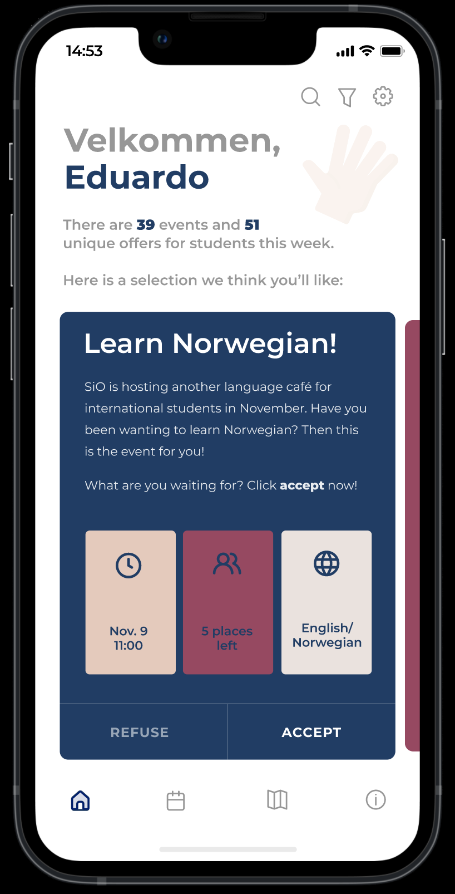
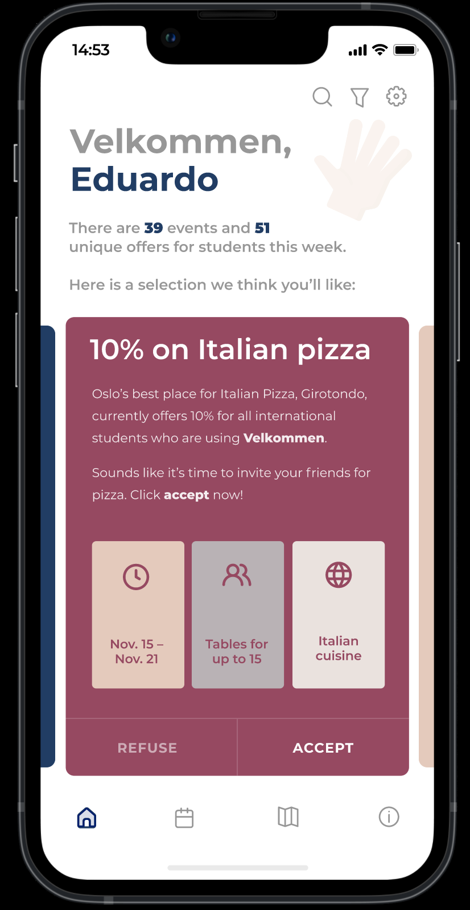

# The "Velkommen" project

This directory contains sketches and final prototypes from a User-Centered Design project I recently finished at the Department of Informatics at the University of Oslo. I designed two separate products/solutions for international students in Oslo based on my findings in multiple interviews and evaluations with users:

## The Figma app prototype
Through my interviews, I discovered that one of the major challenges for new international students arriving in Oslo was simply getting information about what to do and where to go. One possible solution was the **Velkommen** app, an app where international students can scroll through *activity cards* and see a selection of offers and events catered to them. The prototype also includes an activity map and a calendar overview. More photos can be found in the **figma_prototype** folder. The full Figma prototype with flow functionality can be seen here: https://www.figma.com/proto/aXdIQ0A77KkpDtiDhvywjs/Prototype-2?node-id=87%3A84&scaling=scale-down&page-id=0%3A1&starting-point-node-id=3%3A201&show-proto-sidebar=1.

  
  

## The key fob design + alternative e-card design
The key fob design is another product I believe could help make life easier for international students who come to the city. With Bluetooth and NFC capabilities, the little **Velkommen** key fob would unlock special discounts and offers for international students when scanned in restaurants, stores, at museums or elsewhere. With my cardboard model I primarily prototyped weight, size, and keychain functionality.

  
 

The customer data collection part of this design project is bound by anonymity and data protection principles that are important in our student projects at the University of Oslo, so any further information pertaining to my interviewees or their expressed views, opionions, needs, and requirements will not be made publicly availble.
