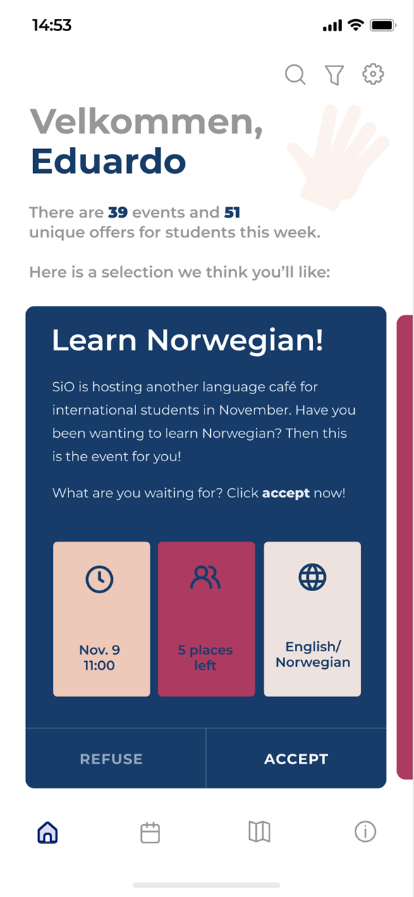

# The "Velkommen" project

This directory contains sketches and final prototypes from a User-Centered Design project I recently finished at the Department of Informatics at the University of Oslo. I designed two separate products/solutions for international students based on my findings in multiple interviews and evaluations with users in my target demographic.

The customer data collection part of this design project is bound by anonymity and data protection principles that are important in our student projects at the University of Oslo, so any further information pertaining to my interviewees or their expressed views, opionions, needs, and requirements will not be made publicly availble.

